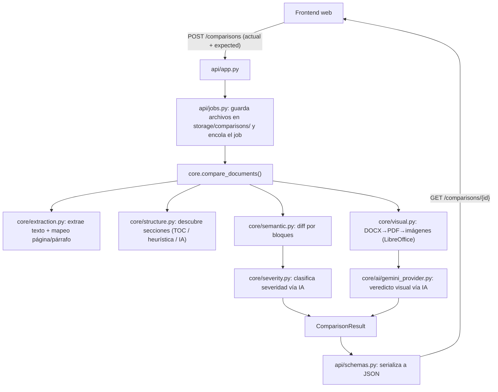

# doc_validation

Motor de comparación y validación de documentos (PDF/DOCX), expuesto como API HTTP para consumo desde un frontend web.

## Objetivo

El proyecto compara un documento **generado** ("actual") contra su **plantilla/documento de referencia** ("expected") y determina si el documento generado se desvía de lo esperado. Resuelve el problema de revisar manualmente documentos legales/financieros (contratos, formatos con datos variables) buscando:

- Secciones o cláusulas faltantes.
- Cambios reales de contenido (texto modificado, eliminado o añadido), distinguiéndolos de simples rellenos de plantilla (campos `[ ]` completados con datos reales).
- Diferencias visuales de formato (tablas, tipografía, márgenes, imágenes), vía IA.

Cada discrepancia se clasifica por severidad (`CRITICO`, `AVISO`, `INFO`) para priorizar la revisión humana.

El proyecto tiene **dos vertientes de uso**:

1. **API HTTP** (implementada): expone el motor de comparación para que un frontend web suba documentos, consulte resultados y gestione el historial de comparaciones.
2. **Automatización con Playwright** (planeada, aún no desarrollada): actualmente solo existe un scaffold del framework (Page Object Model + un test de ejemplo contra `saucedemo.com`), pensado como base para futuras pruebas automatizadas de extremo a extremo sobre el flujo de revisión de documentos. Ver [Cambios recientes](#cambios-recientes) y [Desarrollo y mantenimiento](#desarrollo-y-mantenimiento).

## Arquitectura

El núcleo (`core/`) es independiente de FastAPI y de Playwright: no sabe nada de HTTP ni de tipos de documento específicos. La estructura esperada de cada documento se autodescubre en cada corrida a partir del propio archivo de referencia (TOC nativo → heurística visual → IA), en vez de depender de un catálogo por tipo de contrato.



`api/jobs.py` mantiene una cola en memoria (`ThreadPoolExecutor`) y persiste los archivos subidos en disco (`storage/comparisons/<job_id>/`), lo que permite listar el historial, descargar los archivos originales y volver a ejecutar (`rerun`) una comparación sin resubirlos.

Tras terminar `compare_documents()`, el job también renderiza cada página de ambos documentos a PNG (y, si el original es DOCX, persiste el PDF intermedio generado por LibreOffice) en `storage/comparisons/<job_id>/pages/{actual,expected}/`. Esto habilita un visor de documentos página por página en el frontend (tipo pdf.js), sin depender del análisis visual por IA.

Como ruta alternativa (usada hoy solo desde los tests de integración), `reports/console_reporter.py` y `reports/html_reporter.py` toman el mismo `ComparisonResult` y generan un reporte de consola o un HTML, en vez de la respuesta JSON de la API.

**Rendimiento**: la extracción de texto de ambos documentos, la conversión a imágenes para el análisis visual, y la clasificación de severidad corren en paralelo (`ThreadPoolExecutor`) en vez de secuencial. La clasificación de severidad además agrupa las discrepancias en lotes de hasta 40 por llamada a la IA (en vez de una llamada por discrepancia), procesando los lotes en paralelo.

## Estructura del proyecto

```text
playwright-pytest-pom/
├── api/
│   ├── app.py              # endpoints FastAPI
│   ├── jobs.py             # cola de jobs en memoria + persistencia en storage/
│   └── schemas.py          # modelos pydantic de salida (ComparisonResultOut, ...)
├── core/
│   ├── ai/
│   │   ├── provider.py         # contrato AIProvider (Protocol)
│   │   └── gemini_provider.py  # implementación sobre la API de Gemini, con fallback de modelos
│   ├── extraction.py       # extrae texto + mapeo línea→página/párrafo de PDF/DOCX
│   ├── structure.py        # descubre secciones esperadas (TOC → heurística → IA)
│   ├── structure_ai.py     # fallback de descubrimiento de estructura vía IA
│   ├── semantic.py         # diff determinista por bloques (cambio real vs. relleno de plantilla)
│   ├── severity.py         # clasifica severidad de cada discrepancia vía IA + arma el resumen
│   ├── visual.py           # DOCX→PDF (LibreOffice headless) → imágenes PNG
│   ├── orchestrator.py     # compare_documents(): orquesta las 3 capas de análisis
│   ├── models.py           # dataclasses del dominio (ComparisonResult, SemanticDiscrepancy, ...)
│   └── exceptions.py
├── pages/                  # Page Object Model de Playwright (scaffold, vertiente 2)
│   └── login_page.py
├── tests/
│   ├── test_core_integration.py  # pipeline completo de core/ contra documents/ (requiere GEMINI_API_KEY)
│   ├── test_semantic.py          # unit tests del diff semántico
│   └── test_login.py             # ejemplo Playwright/POM contra saucedemo.com (scaffold, vertiente 2)
├── reports/                # generación de reportes CLI (consola / HTML) a partir de un ComparisonResult
├── documents/              # (gitignorado) documentos reales usados por los tests de integración
├── storage/                # (gitignorado) archivos subidos vía API, generado en runtime
├── conftest.ini            # vacío — ver "Problemas comunes"
├── pytest.ini              # config y markers de pytest
├── requirements.txt
├── Dockerfile              # imagen de la API (solo copia api/ y core/)
└── .dockerignore
```

| Ruta | Descripción |
| ---- | ----------- |
| `core/` | Motor de comparación, agnóstico de HTTP y de tipo de documento. |
| `api/` | Servicio FastAPI que expone `core.compare_documents()` a un frontend. |
| `pages/`, `tests/test_login.py` | Scaffold de Playwright + POM (vertiente 2, aún no desarrollada). |
| `tests/test_core_integration.py`, `tests/test_semantic.py` | Tests de `core/` (unitarios y de integración). |
| `reports/` | Generación de reportes de consola/HTML, usada por los tests de integración. |
| `documents/` | Documentos reales de prueba local (no se versiona). |
| `storage/` | Archivos subidos vía API, persistidos por job (no se versiona). Incluye `pages/actual/` y `pages/expected/` con las páginas renderizadas a PNG y, si aplica, el PDF convertido desde DOCX. |

## Requisitos

- **Python 3.13** (versión usada en `Dockerfile`; ver `requirements.txt` para las dependencias exactas: FastAPI, Uvicorn, Playwright/pytest-playwright, PyMuPDF, python-docx, google-genai, python-dotenv).
- **LibreOffice Writer** instalado, necesario para convertir DOCX a PDF antes de generar el análisis visual (`core/visual.py`). Sin esto, el análisis visual de archivos DOCX se deshabilita automáticamente (no rompe el resto de la comparación).
- **Navegadores de Playwright** instalados (`playwright install`), solo necesarios para correr `tests/test_login.py`.
- **`GEMINI_API_KEY`** (opcional pero recomendada): sin ella, la API arranca igual pero se deshabilitan el descubrimiento de estructura vía IA (fallback), la clasificación de severidad y el veredicto visual.
- Docker, si se prefiere correr la API en contenedor.

## Inicialización

### Local (Windows)

```bash
python -m venv venv
venv\Scripts\activate
pip install -r requirements.txt
playwright install
```

Instala LibreOffice Writer y asegúrate de que `soffice` quede en el `PATH`, o en una de las rutas por defecto que `core/visual.py` busca automáticamente:

- `C:\Program Files\LibreOffice\program\soffice.exe`
- `C:\Program Files (x86)\LibreOffice\program\soffice.exe`

Crea un archivo `.env` en la raíz (ver [Configuración](#configuración)) y levanta la API:

```bash
uvicorn api.app:app --reload
```

### Con Docker

Pensado para cuando el servicio se aloje en un entorno propio (aún por definir). El `Dockerfile` instala LibreOffice vía `apt` y solo empaqueta `api/` y `core/` (no incluye `pages/`, `tests/` ni `reports/`, que son parte del flujo de desarrollo/QA local).

```bash
docker build -t doc-validation-api .
docker run -p 8000:8000 --env-file .env doc-validation-api
```

> `storage/comparisons/` vive dentro del contenedor; si necesitas conservar los archivos subidos entre reinicios del contenedor, monta un volumen sobre esa ruta.

## Configuración

Variables de entorno (archivo `.env` en la raíz, cargado vía `python-dotenv`):

| Variable | Requerida | Descripción |
| -------- | --------- | ----------- |
| `GEMINI_API_KEY` | No (recomendada) | Habilita `GeminiProvider`: descubrimiento de estructura vía IA, clasificación de severidad y veredicto visual. Sin ella, esas funciones se deshabilitan con un aviso en logs, sin tumbar la API. |
| `GEMINI_TEXT_MODELS` | No | Lista de modelos de texto separados por coma, para sobreescribir la cadena de fallback por defecto (`gemini-3.1-flash-lite, gemini-3.5-flash, gemini-2.5-flash, gemini-flash-latest`). |
| `GEMINI_VISION_MODELS` | No | Igual que la anterior, para las llamadas multimodales (análisis visual). |

Otras configuraciones relevantes:

- **CORS** (`api/app.py`): actualmente permite cualquier origen bajo `http://localhost:<puerto>` o `http://127.0.0.1:<puerto>`, pensado para el frontend de desarrollo local que consume esta API.
- **`pytest.ini`**: define el marker `integration` (pruebas lentas que llaman a servicios externos reales — Gemini, LibreOffice) y fuerza `addopts = --headed` para todas las corridas de pytest.

## Uso / Ejecución

### API HTTP

Con el servicio arriba (local o Docker), el frontend interactúa con estos endpoints:

| Método y ruta | Descripción |
| ------------- | ----------- |
| `POST /comparisons` | Sube `actual` + `expected` (multipart), con flags opcionales `enable_visual` y `hide_variable_fills`. Devuelve `job_id`. |
| `GET /comparisons` | Lista comparaciones completadas, con filtros (`status`, `date_from`, `date_to`, `filename`) y paginación. |
| `GET /comparisons/{job_id}` | Estado y resultado de un job (`pending` / `done` / `error`). Cuando está `done`, incluye además `pages.actual_count` / `pages.expected_count` (páginas renderizadas de cada documento) y `pages.error` si el renderizado falló. |
| `GET /comparisons/{job_id}/files/{kind}` | Descarga el archivo original (`actual` o `expected`) de un job. |
| `GET /comparisons/{job_id}/render-pdf/{kind}` | Devuelve el PDF para visor de un lado del job: el archivo original si ya era PDF, o el PDF convertido desde DOCX (persistido, no se regenera en cada request). |
| `GET /comparisons/{job_id}/pages/{kind}/{page_num}` | Devuelve la imagen PNG renderizada de una página específica (`page_num` empieza en 1). |
| `POST /comparisons/{job_id}/rerun` | Vuelve a ejecutar la comparación con los mismos archivos ya almacenados. |

### Tests y reportes de `core/`

```bash
pytest tests/test_semantic.py           # unit tests del diff semántico, sin dependencias externas
pytest -m integration                   # pipeline completo (requiere GEMINI_API_KEY y documents/actual.pdf + documents/expected.docx)
```

`tests/test_core_integration.py` genera además un reporte de consola y `reports/report.html` con el resultado de la comparación.

### Automatización Playwright (vertiente 2 — planeada)

Hoy solo existe el scaffold (`pages/login_page.py` + `tests/test_login.py`, un login de ejemplo contra `saucedemo.com`). Aún no hay pruebas automatizadas sobre el flujo real de revisión de documentos; se ejecuta igual que cualquier test de Playwright/pytest:

```bash
pytest tests/test_login.py
```

## Flujo principal

1. El frontend envía `actual` + `expected` a `POST /comparisons`.
2. `api/jobs.py` guarda ambos archivos en `storage/comparisons/<job_id>/` y encola el trabajo.
3. `core.compare_documents()` orquesta, en orden: extracción de texto en paralelo (`extraction.py`, incluye párrafos y tablas en DOCX), descubrimiento de secciones esperadas a partir del propio `expected` (`structure.py`, con fallback a IA en `structure_ai.py`), diff semántico por bloques (`semantic.py`) que distingue cambios reales de rellenos de plantilla, clasificación de severidad por lotes vía IA (`severity.py`) y, si está habilitado, un veredicto visual (`visual.py` + `core/ai/gemini_provider.py`).
4. Con el resultado ya calculado, el job renderiza las páginas de ambos documentos a PNG (y persiste el PDF convertido si el original era DOCX) antes de marcarse como `done`, para que el frontend pueda mostrar un visor documento por documento.
5. El resultado (`ComparisonResult`) queda disponible vía `GET /comparisons/{job_id}`, serializado a JSON por `api/schemas.py`; las páginas renderizadas se sirven por separado vía `GET /comparisons/{job_id}/pages/{kind}/{page_num}` y `GET /comparisons/{job_id}/render-pdf/{kind}`.
6. Cualquier error del núcleo (`CoreError` y subclases) se captura por job y se expone como `status: "error"`, sin tumbar el servicio ni otros jobs en curso. Un fallo solo en el renderizado de páginas no afecta el resultado de la comparación: queda registrado en `pages.error`.

## Desarrollo y mantenimiento

- **Nuevo proveedor de IA**: implementar el `Protocol` `AIProvider` (`core/ai/provider.py`) en un nuevo módulo dentro de `core/ai/` — no requiere heredar de ninguna clase base.
- **Nuevo endpoint o cambio en el ciclo de vida de un job**: lógica de negocio en `api/jobs.py`, ruta en `api/app.py`, forma de la respuesta en `api/schemas.py`.
- **Reglas de comparación semántica** (qué cuenta como relleno de plantilla vs. cambio real): `core/semantic.py`.
- **Criterios de severidad**: prompt y parsing en `core/severity.py`.
- **Descubrimiento de estructura**: heurísticas en `core/structure.py`; prompt de fallback por IA en `core/structure_ai.py`.
- **Extracción de DOCX** (qué se lee del documento: párrafos, tablas, orden entre ambos): `_iter_block_items` y `_extract_from_docx` en `core/extraction.py`.
- **Render de páginas para el visor del frontend** (PNG por página, PDF persistido para DOCX): `_persist_pages` en `api/jobs.py`; los endpoints que lo exponen están en `api/app.py`.
- **Vertiente 2 (Playwright)**: al desarrollarse, los Page Objects van en `pages/` y los tests en `tests/`, siguiendo el patrón ya usado por `login_page.py`/`test_login.py`.

## Problemas comunes

- **`conftest.ini` está vacío**: la configuración real de pytest vive en `pytest.ini`; `conftest.ini` es un archivo residual en su estado actual, sin efecto.
- **`pytest.ini` fuerza `--headed`** para todas las corridas de pytest, incluidas las que no usan un navegador (`test_semantic.py`, `test_core_integration.py`). En un entorno sin entorno gráfico (CI, servidor headless) esto puede hacer fallar la ejecución de `tests/test_login.py`.
- **`VisualUnavailableError` / análisis visual deshabilitado**: ocurre cuando `soffice` (LibreOffice) no está en el `PATH` ni en las rutas por defecto de Windows que busca `core/visual.py`. No detiene la comparación; el resultado queda con `visual.available = False` y el motivo en `visual.error`.
- **`test_core_integration.py` se salta automáticamente** si no hay `GEMINI_API_KEY` configurada (`@pytest.mark.skipif`).
- **No existe `.env.example`**: las variables de entorno soportadas están documentadas arriba en base al código (`core/ai/gemini_provider.py`), pero no hay un archivo de referencia en el repo.
- **Los tiempos de cada etapa de `compare_documents()` se imprimen a stdout con `print(...)`** (prefijo `[TIMING]`) en `core/orchestrator.py`, en vez de pasar por el logger estándar del proyecto (`logging`, ya usado en `api/app.py`). Útil para diagnosticar cuellos de botella, pero no queda integrado con el resto del logging de la API.

## Cambios recientes

- El job ahora **renderiza y persiste las páginas de ambos documentos** como imágenes PNG (y, para DOCX, el PDF convertido) en `storage/comparisons/<job_id>/pages/`, con nuevos endpoints (`render-pdf`, `pages/{kind}/{page_num}`) y un conteo de páginas (`pages.actual_count`/`pages.expected_count`) en la respuesta del job — pensado para un visor de documentos en el frontend.
- La **extracción de DOCX ahora incluye el contenido de tablas** (antes solo párrafos), preservando el orden real entre párrafos y tablas y evitando duplicados por celdas combinadas.
- La **clasificación de severidad** ahora agrupa las discrepancias en lotes de hasta 40 por llamada a la IA (antes una llamada por discrepancia), con los lotes en paralelo; la extracción de texto y la conversión a imágenes para el análisis visual también se paralelizaron. Se agregaron mediciones de tiempo (`[TIMING]`) por etapa para monitorear el impacto.
- Se agregó el `Dockerfile` (con instalación de LibreOffice vía `apt`) y `.dockerignore` para empaquetar el servicio de la API.
- Los archivos subidos vía API se **persisten** en `storage/comparisons/<job_id>/` en vez de un directorio temporal que se borraba al terminar el job, habilitando listar el historial, descargar los archivos originales y re-ejecutar (`rerun`) una comparación sin volver a subirlos.

## Referencias

- [FastAPI](https://fastapi.tiangolo.com/) — framework usado en `api/`.
- [Playwright para Python](https://playwright.dev/python/) — usado en `pages/` y `tests/test_login.py`.
- [PyMuPDF (fitz)](https://pymupdf.readthedocs.io/) — extracción y renderizado de PDF en `core/extraction.py` y `core/visual.py`.
- [python-docx](https://python-docx.readthedocs.io/) — lectura de archivos DOCX en `core/extraction.py` y `core/structure.py`.
- [Google Gen AI SDK](https://googleapis.github.io/python-genai/) — cliente usado en `core/ai/gemini_provider.py`.
